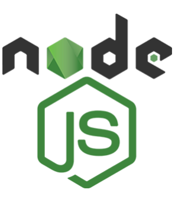

# Todo Full Stack - MERN App

### Table of Contents

- [Prerequisites](#Prerequisites)
- [Tech Stack](#Tech-Stack)
- [Interaction](#Interaction)
- [Screenshot](#Screenshot)
- [Links](#Links)
- [Getting Started](#Getting-Started)
- [Deployment](#Deployment)
- [Structure](#Structure)
- [Author](#Author)

### Prerequisites

-  _npm: Node Package Manager for JavaScript_
-  _Vite: Frontend build tool for modern web development_
-  _TypeScript: Typed superset of JavaScript._

#

### Tech Stack

-  _Node.js: JavaScript runtime environment_
-  _Express: Minimalist web framework for Node.js_
-  _MUI: React components for Material Design UI._
-  _Mongoose: MongoDB object modeling for Node.js._
-  _Redux Toolkit: A simplified and efficient way to manage state in Redux applications._

### Interaction

- Add new todos to the list
- Mark todos as complete
- Delete todos from the list
- Edit existing todos
- Filter todos by all/active/complete
- Clear all completed todos
- Toggle light and dark mode
- Sort todos by their create time in ascending (oldest first) and descending (newest first) order.
- View optimal layout for the app depending on their device's screen size
- See hover states for all interactive elements on the page
- View the last status update time of todos on hover

### Screenshot


### Links

- Solution URL: [Add solution URL here](https://github.com/DavitDvalashvili/todo-mern-app)
- Live Site URL: [Add live site URL here](https://todo-mern-app-client.vercel.app)

### Getting Started

1. First of all you need to clone app repository from github:

```
git clone https://github.com/DavitDvalashvili/todo-mern-app.git
```

2. Next step requires install all the dependencies.

```
npm install
```

3. To see project in action

```
npm run dev
```

### Deployment

Before every deployment you need to create build file.

```
npm run build
```

after this you can use this file to deploy project on server.

## Structure

```
|-- api
| |-- controllers
| |-- models
| |-- routes
| |-- utils
| |-- index.js
|-- readme
|-- client
| |-- public
| |--src
| | |-- App
| | | |-- store.ts
| | | |-- hook.ts
| | |-- Feature
| | | |-- themeSlice.ts
| | | |-- todoSlice.ts
| | |-- components
| | |-- app.js
| | |-- main.js
| | |-- theme.ts
| | |-- types.ts
| | |-- moduleAugmentation.ts
| | |-- main.js
| |--index.html

```

### Author

- Github profile - [Add your name here](https://github.com/DavitDvalashvili)
- Linkedin profile - [Add your name here](https://www.linkedin.com/in/davit-dvalashvili-0421b6253)
- Email - [@your_username](davitdvalashvili1996@gmail.com)
